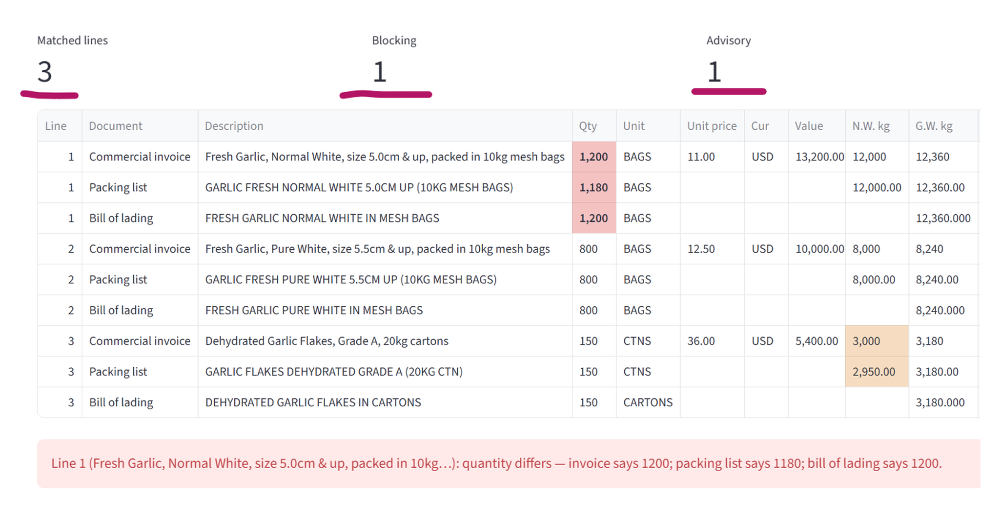

# ClearLens

[](https://github.com/yakhero/clearlens/actions/workflows/tests.yml)

**Agentic document intelligence for trade and logistics operations.**

A clearing agent prepares an import declaration from three PDFs — a commercial invoice, a
packing list and a bill of lading — that rarely agree with each other, then picks a tariff
code by hand. ClearLens reads all three, reconciles them line by line, ranks candidate PCT
codes out of the parsed FBR tariff with the heading text and rate behind each one, and
computes the full duty cascade. A person confirms the code; nothing is filed automatically.

**Live demo:** https://clearlens-123.streamlit.app

Built for the HEC–NCEAC & PEC Generative & Agentic AI Training, Cohort 11 — Final Hackathon.

## The rule this repo is built on

> **The model reads and writes. Code computes and decides.**

Pakistani import levies cascade: customs duty, additional customs duty and regulatory duty
are charged on CIF; sales tax is charged on CIF plus those duties; withholding tax is charged
on all of it. So a wrong tariff code does not cost you the rate difference — it compounds.

On a CIF of Rs 10,000,000 of garlic, two codes from the same heading in the FY 2026-27
tariff — 0703.2000 *Garlic* at 0% and 0703.9000 *Leeks and other alliaceous vegetables* at
10%:

| | Correct: 0703.2000 (CD 0%) | Wrong: 0703.9000 (CD 10%) |
|---|---|---|
| Customs duty | 0 | 1,000,000 |
| Additional customs duty (2%) | 200,000 | 200,000 |
| Sales tax (18%) | 1,836,000 | 2,016,000 |
| Withholding tax (5.5%) | 661,980 | 726,880 |
| **Total taxes** | **2,697,980** | **3,942,880** |

One wrong digit in the code is a 10-point gap in the duty rate, and it becomes a
**12.45-point** gap in cost — Rs 1,244,900 on one container. That arithmetic is in
`core/duty.py`, it uses `Decimal` throughout, and it is covered by tests. No language model is
asked to compute money anywhere in this project.

The ACD, sales tax and withholding rates in that table are the placeholders in
`config/rates.json`; see **Honest limits** below before quoting the figure anywhere.

## Pipeline

Exactly one stage uses a language model. Everything else is deterministic code or a person.

| # | Stage | Type | What it does |
|---|-------|------|--------------|
| 1 | Ingestion | code | PDF → per-page text with page numbers |
| 2 | Extraction agents (×3) | **LLM** | Each document → `LineItem[]` against the frozen schema |
| — | Citation check | code | Every extracted value must be findable on the page it cites, or the row is flagged |
| 3 | Reconciler | code | Three sets → matched lines + `Discrepancy[]`, blocking or advisory |
| — | **Human gate 1** | person | Resolve each mismatch, confirm the lines |
| 4 | Tariff search | code | Line description → ranked candidate PCT codes from `pct_codes.csv`, each with its heading text and rate |
| — | **Human gate 2** | person | Confirm or override the tariff code on every line |
| 5 | Duty engine | code | `DutyResult` — the full cascade, per line and in total |

**Not built.** Tariff code selection is keyword search over the parsed tariff, not an LLM
classifier — a model never picks a code. There is no filing-pack generator and no Excel
export; step 5 is where the app ends.

## Run it

```bash
pip install -r requirements.txt
python run_tests.py          # no API key needed — currently 103/103
python -m core.tariff        # rebuild data/tariff/pct_codes.csv from the FBR PDF
export GEMINI_API_KEY=...    # or put it in .streamlit/secrets.toml (git-ignored)
streamlit run app.py         # without a key, the offline demo (mock.json) still runs
```

## Reconciliation, mid-run



## Layout

```
core/schemas.py   FROZEN data contract — everything is written against this
core/duty.py      the cascade; Decimal only, unit-tested
core/tariff.py    tariff PDF → pct_codes.csv; lookup() and search()
core/reconcile.py match lines across the three documents, flag mismatches
core/llm.py       Gemini client, standard library only, structured JSON output
core/extract.py   three extraction agents + the citation check (code, not model)
core/demo_docs.py renders mock.json as the three demo PDFs
app.py            Streamlit UI: five steps, two human gates
config/rates.json levy rates with their legal source and a verified flag
tests/            the numbers the pitch claims
data/tariff/      PCT codes and duty rates parsed from the FBR tariff (not hand-typed)
data/consignments/ anonymised demo document sets
docs/PRD.md       product requirements document
```

## Status

- [x] Data contract frozen
- [x] Duty engine + tests
- [x] Tariff parser (FBR Pakistan Customs Tariff FY 2026-27 → CSV — 7,598 codes, 96 chapters)
- [x] Extraction agents with a code-side citation check (needs GEMINI_API_KEY)
- [x] Reconciler, blocking vs advisory
- [x] Streamlit UI with both human gates (upload, demo PDFs, or offline mock data)
- [x] Tariff search behind human gate 2
- [ ] LLM classification agent with tariff retrieval
- [ ] Filing pack and Excel export

## How this was built

Built over a hackathon weekend with Claude (Claude Code) as the coding assistant; a large
share of the Python in this repository was written by it, and the commit history shows which
commits those were. I set the problem and the domain, sourced the FBR tariff and checked the
parser's output against the source PDF by hand, decided what each module had to guarantee,
and reviewed and merged every change. If you want to know why something is the way it is,
ask me — I can answer for all of it.

## Honest limits

ClearLens prepares and checks; it does not file. There is no PSW integration. It computes on
the declared CIF value, not the customs valuation database. Regulatory duty and exemptions
move through SROs, so every rate in `config/rates.json` carries its source and a `verified`
flag — **all of them are currently `false`**. That is deliberate: nobody on this project has
yet opened the governing SRO or statute for a single rate, so the flags stay `false` until
someone does. Treat every rupee figure in this repository, including the worked example
above, as a demonstration of the arithmetic and not as a quote. Demo documents are
anonymised and company profiles are fictional. This is not customs advice.

## Licence

MIT — see [LICENSE](LICENSE). The licence covers the code in this repository. It does not
cover `data/tariff/pakistan_customs_tariff_2026-27.pdf`, which is a Government of Pakistan
(FBR) publication included here for reproducibility and remains subject to its own terms.
